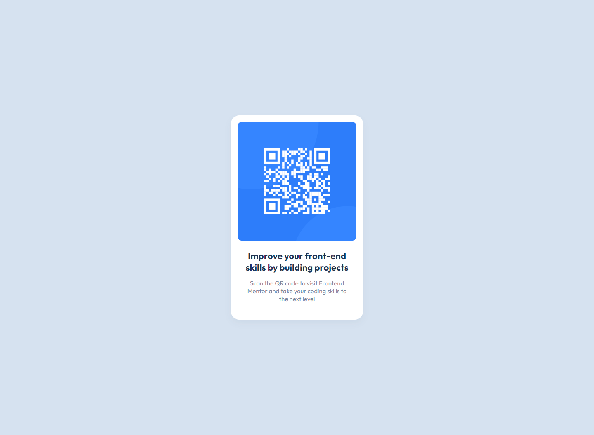

# Frontend Mentor - QR code component solution

This is a solution to the [QR code component challenge on Frontend Mentor](https://www.frontendmentor.io/challenges/qr-code-component-iux_sIO_H). Frontend Mentor challenges help you improve your coding skills by building realistic projects.

## Table of contents

- [Overview](#overview)
  - [Screenshot](#screenshot)
  - [Links](#links)
- [My process](#my-process)
  - [Built with](#built-with)
  - [What I learned](#what-i-learned)
  - [Continued development](#continued-development)
  - [Useful resources](#useful-resources)
- [Author](#author)

## Overview

### Screenshot

#### Desktop version of the design

### Links

- Solution URL: [https://github.com/miranlegin/fem-qr-code-component](https://github.com/miranlegin/fem-qr-code-component)
- Live Site URL: [https://frontend-mentor-challenge02.netlify.app/](https://frontend-mentor-challenge02.netlify.app/)

## My process

### Built with

As this is one of the easiest challenges on Frontend Mentor platform this is absolute overkill of a setup but i decided to stick to it for more challenging tasks along the road. I'm running Grunt which is compiling Assemble.io templates into static HTML files. Alongside is SCSS which is also using Grunt to render static CSS files.

- SCSS
- [Grunt](https://gruntjs.com/) - Javascript task runner
- [Assemble.io](https://assemble.io/) - Static site generator

### What I learned

I've used this example to familiarize with Frontend Mentor platform and all the necessary steps needed to submit solution. Prior to this challenge i have created account on netlify to be able to submit solutions and connected it to my github account.

### Continued development

My plan is to use this platform to challenge myself at least once a week to submit even one solution.

### Useful resources

- [Guide to submitting solution to Frontend Mentor](https://medium.com/frontend-mentor/a-complete-guide-to-submitting-solutions-on-frontend-mentor-ac6384162248)
- [Link and deploy to Netlify from Github](https://www.netlify.com/blog/2016/09/29/a-step-by-step-guide-deploying-on-netlify/)

## Author

- Frontend Mentor - [@miranlegin](https://www.frontendmentor.io/profile/miranlegin)
